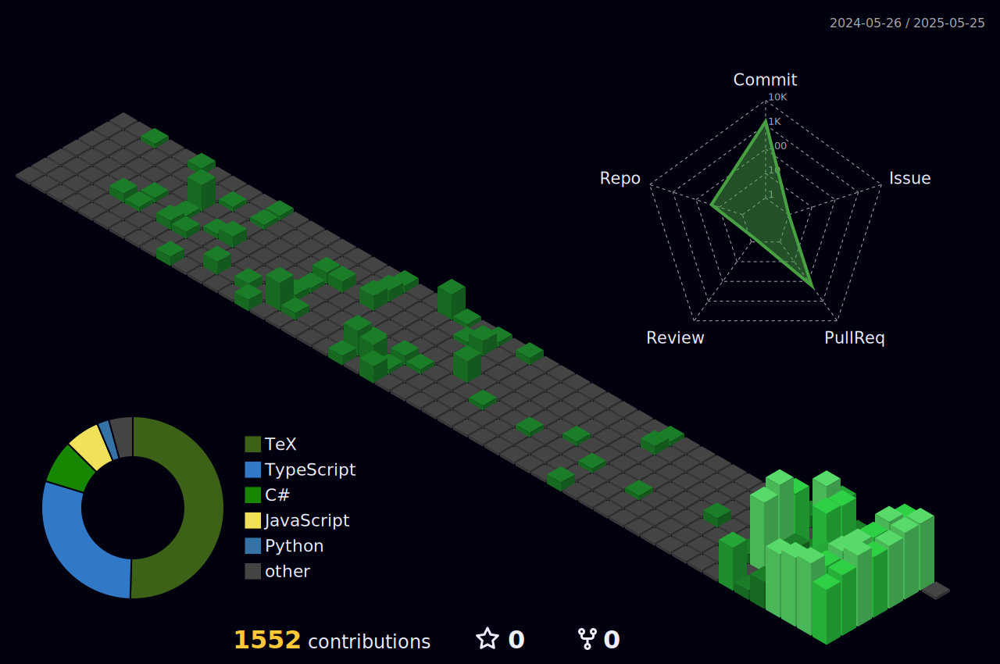

> THIS IS A WORK IN PROGRESS PROJECTS DATA SHOWN HERE MAY NOT BE AS ACURATE AS POSSIBLE

---

## 

👋 Hi, I’m Subroto Saha 👀 I’m interested in React, Nextjs, ExpressJs, Artificial Intelligence & Dev-Ops. 🌱 I’m currently working as . 💞️ I’m looking to collaborate on Javascript and Typescript Projects. 📫 Contact me at isubrotosaha@gmail.com

## Find me around the web 🌎: 

- Learning in public on <a href="https://www.twitch.tv/blacktechdiva">Twitch</a> or <a href="https://www.monica.dev">monica.dev</a> 📹 ✍🏾
- Tinkering with interactions on <a href="https://codepen.io/m0nica"> Codepen</a> 🏓
- Sharing updates on <a href="https://www.linkedin.com/in/monicampowell/">LinkedIn</a> 💼

###

  
  
  

###

  

###

<h1 align="center">hey there 👋</h1>

###

<h3 align="left">👩‍💻  About Me</h3>

###

I'm Subroto Saha from Nilphamari, Bangladesh  - 🔭 I’m working as Owner of CityTraders - 📚 I'm currently learning Ai - ⚡ In my free time I Code.

###

<h3 align="left">🛠 Language and tools</h3>

###

  
  
  
  
  
  
  
  
  
  
  
  
  
  
  

###

<h3 align="left">🔥   My Stats :</h3>

###

  

###

### Recent Blog posts

<!-- BLOG-POST-LIST:START -->

<!-- BLOG-POST-LIST:END -->

i am working on it

<!-- START OF PROFILE STACK, DO NOT REMOVE -->

| 💻 **Technology**                                                                                                                      | 🚀 **Projects**                                                                                                                                                                                                                                                                                                                                                                                                                                                                                                                                                                                                                                                                                                                                                                                                                                                           |
| -------------------------------------------------------------------------------------------------------------------------------------- | ------------------------------------------------------------------------------------------------------------------------------------------------------------------------------------------------------------------------------------------------------------------------------------------------------------------------------------------------------------------------------------------------------------------------------------------------------------------------------------------------------------------------------------------------------------------------------------------------------------------------------------------------------------------------------------------------------------------------------------------------------------------------------------------------------------------------------------------------------------------------- |
|          |      |
|  |                                                                                                                                                                                                                                                                                                                                                                                                                                                                        |

<!-- END OF PROFILE STACK, DO NOT REMOVE -->

new section

### :zap: Recent Activity

<!--START_SECTION:activity-->

1. 🚀 Published release [v0.3.2](https://github.com/extinctCoder/fast_api/releases/tag/v0.3.2) in [extinctCoder/fast_api](https://github.com/extinctCoder/fast_api)
2. 🚀 Published release [v0.2.1](https://github.com/extinctCoder/fast_api/releases/tag/v0.2.1) in [extinctCoder/fast_api](https://github.com/extinctCoder/fast_api)
3. 🚀 Published release [v0.0.10](https://github.com/extinctCoder/fast_api/releases/tag/v0.0.10) in [extinctCoder/fast_api](https://github.com/extinctCoder/fast_api)
4. 🚀 Published release [0.0.9](https://github.com/extinctCoder/fast_api/releases/tag/0.0.9) in [extinctCoder/fast_api](https://github.com/extinctCoder/fast_api)
5. ❗ Opened issue [#2310](https://github.com/JessicaLim8/JessicaLim8/issues/2310) in [JessicaLim8/JessicaLim8](https://github.com/JessicaLim8/JessicaLim8)
<!--END_SECTION:activity-->
